# Projeto Nutriz+ / Conecta Lactare

**Aplicativo Android para doação de leite humano**

## Objetivo da Aplicação
O aplicativo **Nutriz+ (Conecta Lactare)** tem como objetivo principal conectar mães doadoras ao Banco de Leite Humano Lactare (iniciativa da Eurofarma), criando um ecossistema digital integrado. O foco é escalar o impacto social e facilitar a jornada de doação de leite humano, reduzindo as barreiras físicas e mentais entre a doadora e o bebê. A solução adota um design focado no **"UX Pós-Parto"**, oferecendo navegação acessível, processos desburocratizados (*skip-the-forms*) e integração perfeita para acompanhamento logístico e engajamento.

## Motivação e Impacto (ESG)
A mortalidade infantil por causas evitáveis e a grande quantidade de bebês prematuros (mais de 200 mil anualmente no Brasil) exigem ações rápidas e efetivas. O projeto **Conecta Lactare** alinha-se diretamente aos pilares sociais do **ESG**, apoiando a saúde materno-infantil e contribuindo ativamente para a redução da mortalidade neonatal.

A doação de leite materno é vital, mas o processo atual frequentemente impõe desafios como burocracia excessiva, múltiplos contatos dispersos e insegurança das mães. Nossa solução digitaliza e centraliza esse fluxo, garantindo praticidade para a doadora (acolhimento 24/7, menos burocracia) e otimização para a operação do banco de leite (escala de alcance, rastreabilidade e gestão orientada a dados).

## Equipe Multidisciplinar Nutriz+
- Gabriel Doná Braga Araujo (RM558142)
- Gabriel Jose Lima da Silva (RM556695)
- Gabriel Shoiti Yoshida (RM558945)
- Matheus Keizo S. Hangui (RM557834)
- Lucas Vendramini Lubianco (RM556161)

## Tecnologias Utilizadas
O aplicativo foi construído utilizando as melhores práticas do desenvolvimento Android moderno e Arquitetura Limpa:
- **Kotlin**: Linguagem principal, moderna e segura.
- **Jetpack Compose**: Para a construção de toda a interface de usuário (UI) de forma declarativa, responsiva e com suporte a *Material Design 3*.
- **Navigation Compose**: Gerenciamento de rotas, transições de tela e passagem de argumentos de forma nativa.
- **Coroutines & Flow**: Para programação assíncrona, gerenciamento reativo de estado (`StateFlow`) e atualização dinâmica da UI.
- **MVVM (Model-View-ViewModel)**: Arquitetura adotada para separar a lógica de negócios da camada de interface, garantindo organização e manutenibilidade.

---

## Telas e Funcionalidades (Evidências e Tecnologias)

O aplicativo conta com uma navegação robusta compreendendo **15 telas principais**, projetadas para oferecer a melhor experiência à doadora.

### 1. Splash Screen
**Descrição:** Tela inicial de carregamento com a marca do aplicativo, exibida brevemente enquanto a aplicação inicializa.
**Tecnologias:** `LaunchedEffect` (Coroutines) para temporização assíncrona, `Image` e animações de entrada suaves (`AnimatedVisibility`).

### 2. Onboarding
**Descrição:** Carrossel interativo explicando os benefícios e o funcionamento da plataforma Nutriz+ para novas usuárias.
**Tecnologias:** `HorizontalPager` do Compose Foundation para deslizamento de páginas, indicadores de progresso customizados e gerenciamento de estado da página atual.

### 3. Login
**Descrição:** Interface de autenticação segura e simplificada.
**Tecnologias:** Campos de texto (`OutlinedTextField`) com gerenciamento de estado focado em segurança (VisualTransformation para senhas) e simulação de autenticação reativa.

### 4. Dashboard da Doadora (Home Page)
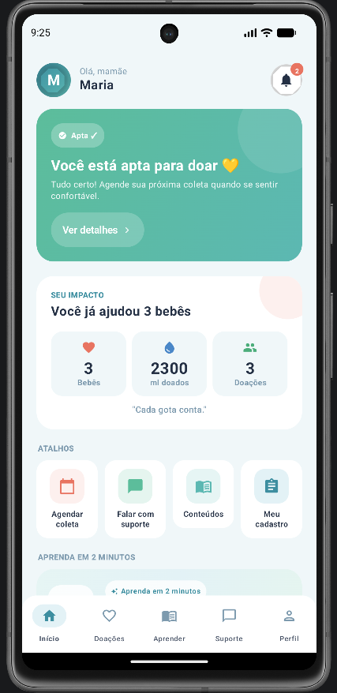
**Descrição:** Centraliza a jornada da doadora, mostrando o status atual ("Em triagem", "Aprovada"), impacto social em tempo real (litros doados e bebês ajudados) e acesso a atalhos rápidos.
**Tecnologias:** `LazyColumn` para rolagem otimizada, `Card` customizado com *Gradients* e `ViewModel` fornecendo os estados.

### 5. Cadastro
**Descrição:** Formulário de registro inicial onde a mãe fornece dados básicos de identificação e contato.
**Tecnologias:** `StateFlow` e `ViewModel` para reter o preenchimento de campos sem perda de dados durante a navegação, e validação reativa de formulários.

### 6. Triagem e Elegibilidade
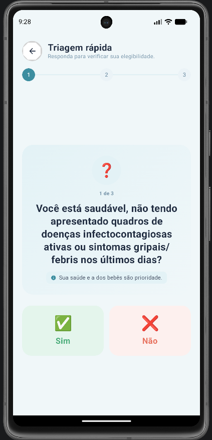
*(Outras etapas: [Img02](docs/evidencias/Img02_triagemScreen.png), [Img03](docs/evidencias/Img03_triagemScreen.png), [Img04](docs/evidencias/Img04_triagemScreen.png))*
**Descrição:** Questionário interativo que avalia a elegibilidade da mãe. Adota o conceito *"skip-the-forms"* com perguntas curtas, respeitando a carga mental do puerpério.
**Tecnologias:** `AnimatedContent` para transições fluídas entre perguntas e acompanhamento iterativo via progresso (`NutrizProgressSteps`).

### 7. Envio de Documentos (Integração ANVISA)
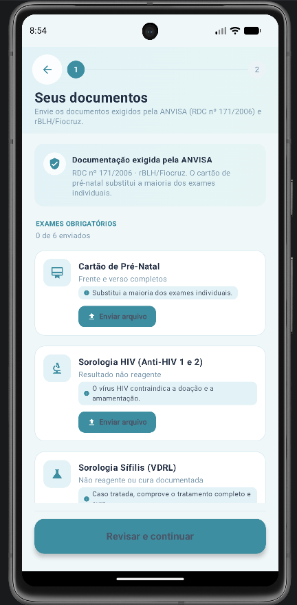
*(Revisão: [Img02](docs/evidencias/Img02_documentosScreen.png))*
**Descrição:** Área para upload de exames e documentos exigidos pela ANVISA (RDC nº 171/2006). Divide o processo em upload guiado e etapa de revisão.
**Tecnologias:** Componentes complexos com `AnimatedVisibility`, `MutableStateMap` para rastrear uploads e *Feedback Visual* (cores semânticas).

### 8. Meus Documentos (Status e Reenvio)
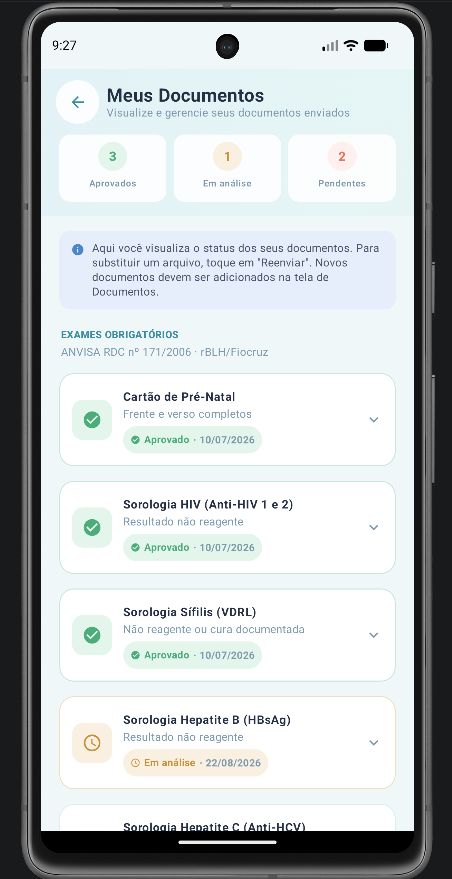
**Descrição:** Acompanhamento dos documentos já enviados. Exibe status de aprovação ("Aprovado", "Em Análise", "Pendente" ou "Rejeitado"), permitindo reenvio se necessário.
**Tecnologias:** Uso de listas expansíveis (*Expandable Cards*) no Compose com animações `expandVertically` e `shrinkVertically`.

### 9. Agendamento de Coleta
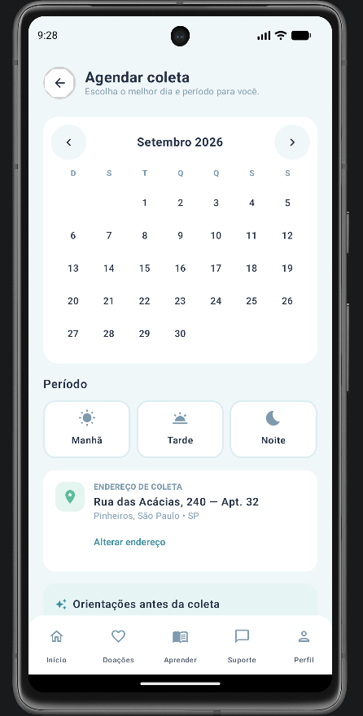
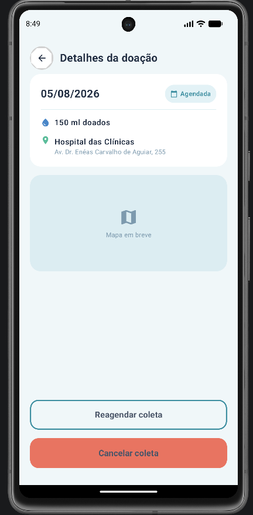
**Descrição:** Permite à doadora agendar ou editar a coleta domiciliar dos frascos de leite.
**Tecnologias:** Interação com modais do tipo `BottomSheet` interativos, manipulação de estado complexo para datas e horários, e *Dropdown Menus*.

### 10. Detalhes do Agendamento
**Descrição:** Visão expandida de um agendamento específico (coleta futura ou passada), com opções para reagendar ou cancelar.
**Tecnologias:** Passagem de parâmetros através de rotas no `Navigation Compose` (ex: `detalhes_agendamento/{id}`) e recuperação dinâmica de dados.

### 11. Perfil e Gamificação
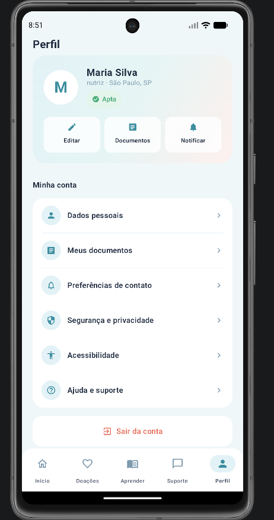
**Descrição:** Gerenciamento do perfil geral com sistema de Gamificação. A mãe visualiza sua "Badge" (selo de reconhecimento) que evolui conforme sua assiduidade nas doações.
**Tecnologias:** Menu estruturado, navegação aninhada para as opções internas e estilização complexa de *Hero Cards*.

### 12. Dados Pessoais
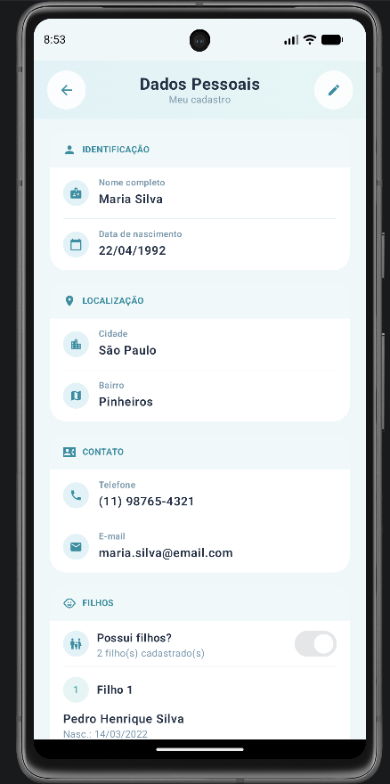
**Descrição:** Tela extensa de formulário (agrupada no escopo do Perfil) que permite visualizar e editar informações completas da mãe e de seus bebês.
**Tecnologias:** Múltiplos componentes de entrada de dados, modais de confirmação (`AlertDialog`) e simulação de persistência assíncrona.

### 13. Histórico de Doações
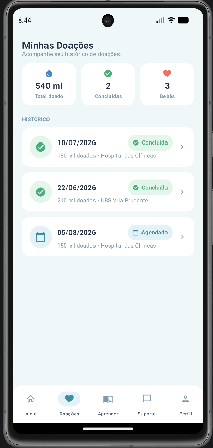
**Descrição:** Timeline detalhada listando todas as coletas já realizadas, mostrando a quantidade (ml) de leite doada em cada uma.
**Tecnologias:** `LazyColumn` configurado para renderização de listas longas sem perda de performance.

### 14. Conteúdo Educativo (Microlearning)
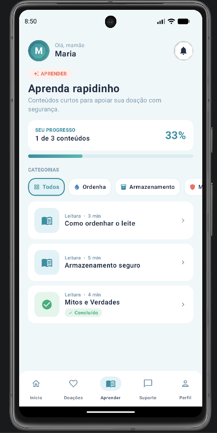
**Descrição:** Pílulas de conhecimento (guias, mitos e verdades) para capacitar a doadora sobre ordenha, preparo de frascos e armazenamento.
**Tecnologias:** Estrutura de abas (`TabRow`/`Tab` do Material 3) para separar "Para Você" e "Guias Rápidos", além de exibição de *Cards* customizados.

### 15. Notificações
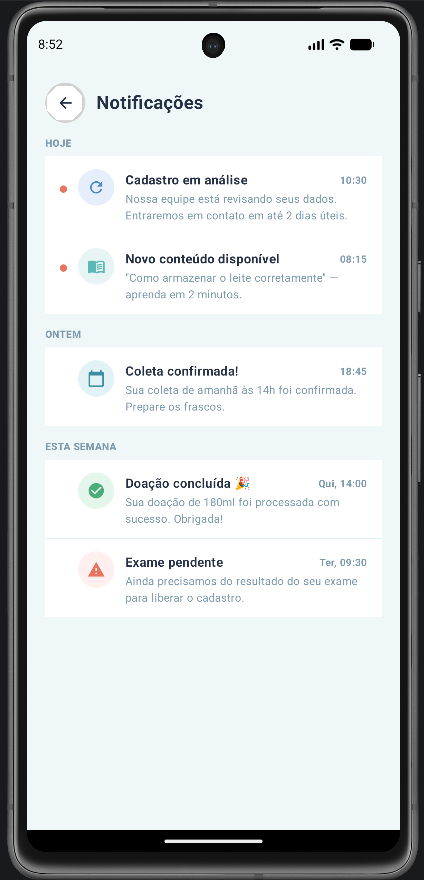
**Descrição:** Centraliza os alertas recebidos, como aprovação em triagem, lembretes de agendamentos e atualizações sistêmicas.
**Tecnologias:** Filtragem de estado da UI com `TabRow` (Geral vs Atualizações) e renderização de listas focadas em leitura rápida.

### 16. Suporte Omnichannel
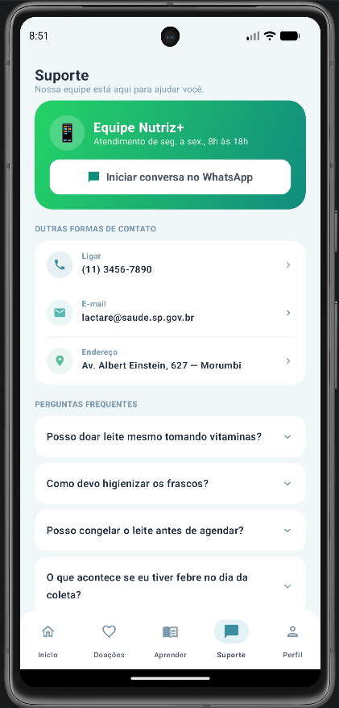
**Descrição:** Canal de comunicação direto com enfermeiras (integração WhatsApp), reduzindo ansiedades e dúvidas sensíveis rapidamente.
**Tecnologias:** *Intents* nativos do Android (`ACTION_VIEW`, `ACTION_DIAL`) para redirecionamento transparente e seguro aos canais externos do sistema operacional.

---

## Como Executar o Projeto

1. Faça o clone deste repositório:
   ```bash
   git clone <url-do-repositorio>
   ```
2. Abra a pasta do projeto (`NutrizApp`) no **Android Studio** (versão recomendada: Iguana ou superior).
3. Aguarde a sincronização do Gradle.
4. Execute o aplicativo clicando no botão **Run** (`Shift + F10`) e escolha um emulador ou dispositivo físico rodando Android 7.0 (API 24) ou superior.
5. Emulador utilizado para rodar esta aplicação: Pixel 7 (4GB de RAM e 512 VM heap Size)
